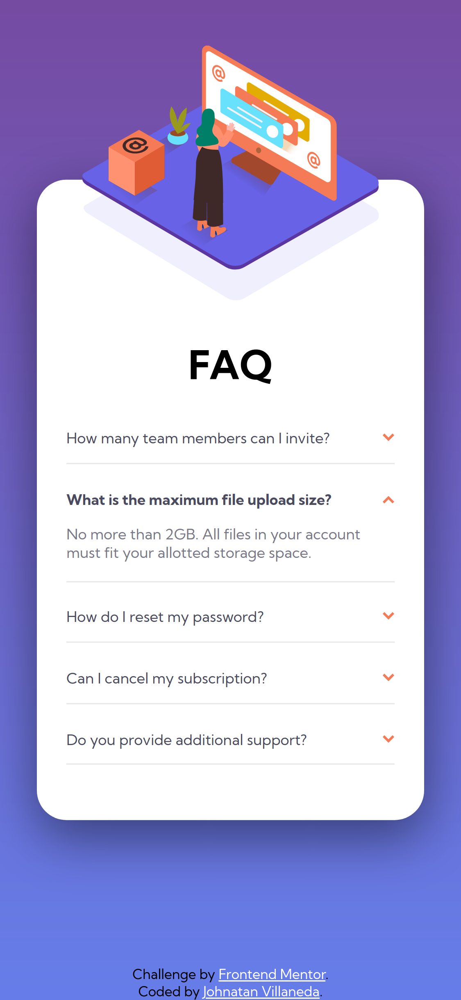
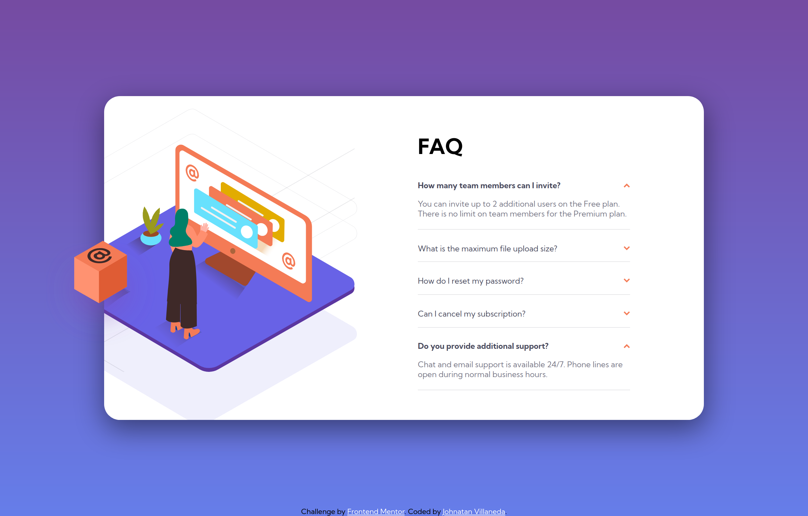

# Frontend Mentor - FAQ accordion card solution

This is a solution to the [FAQ accordion card challenge on Frontend Mentor](https://www.frontendmentor.io/challenges/faq-accordion-card-XlyjD0Oam). Frontend Mentor challenges help you improve your coding skills by building realistic projects.

## Table of contents

- [Overview](#overview)
  - [The challenge](#the-challenge)
  - [Screenshot](#screenshot)
  - [Links](#links)
- [My process](#my-process)
  - [Built with](#built-with)
- [Author](#author)

## Overview

### The challenge

Users should be able to:

- View the optimal layout for the component depending on their device's screen size
- See hover states for all interactive elements on the page
- Hide/Show the answer to a question when the question is clicked

### Screenshot

### Links

- Solution URL: [Github Repo](https://github.com/JohnnatanV/faq-card-page)
- Live Site URL: [Github pages live site](https://johnnatanv.github.io/faq-card-page/)

## My process

### Built with

- Semantic HTML5 markup
- CSS custom properties
- Javascript vanilla
- Flexbox
- Mobile-first workflow

## Author

- Website - [Johnnatan Villaneda](https://portfolio-cv-2u77x15g8-johnnatanv.vercel.app/)
- Frontend Mentor - [@JohnnatanV](https://www.frontendmentor.io/profile/JohnnatanV)
- Twitter - [@JohnnatanV](https://twitter.com/JohnnatanV)
